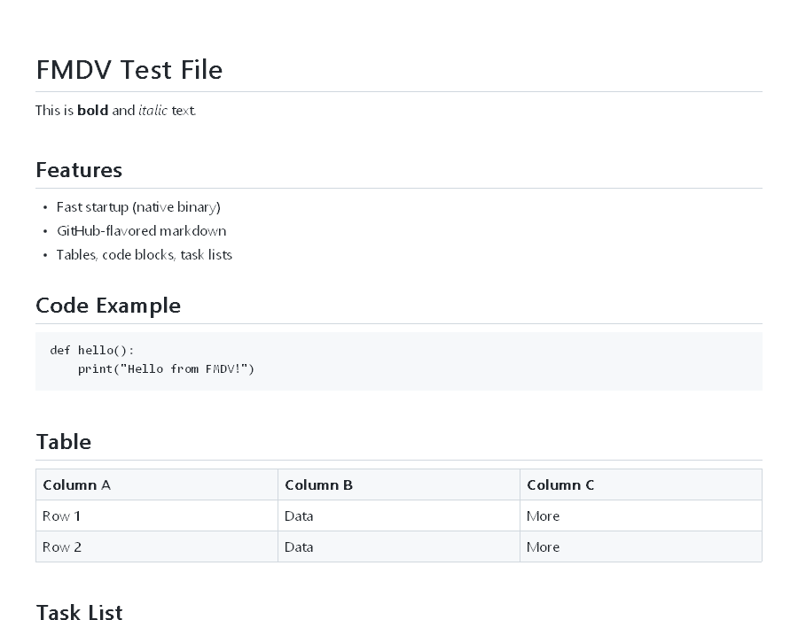
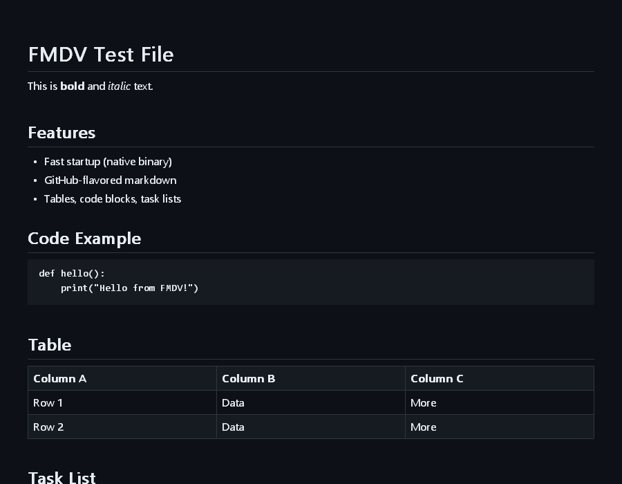
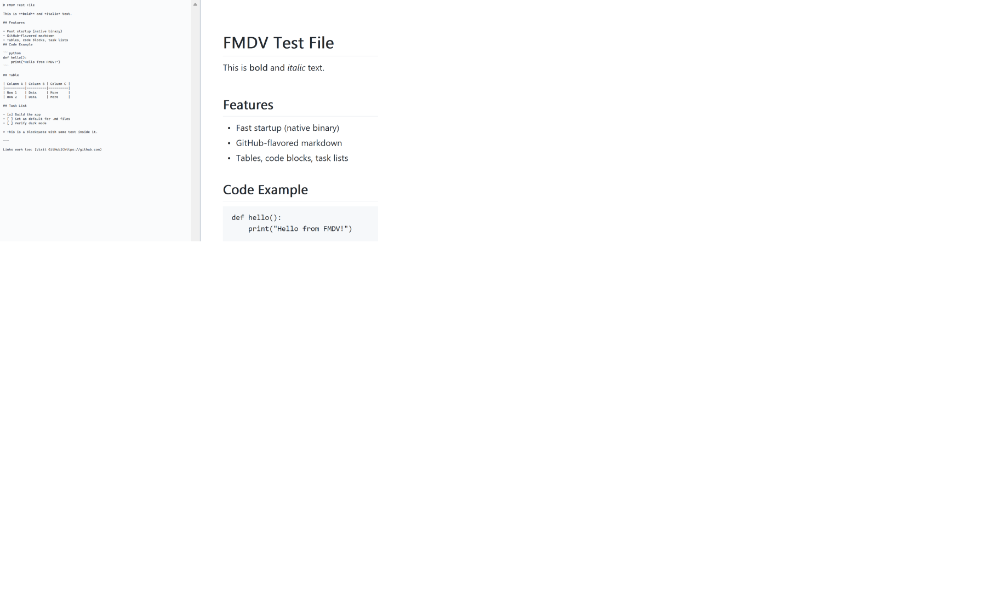

# FMDV — Fast MD Viewer

Native Windows markdown viewer/editor. Custom parser + Win32/GDI layout and
rendering. No browser engine.

- **~40–55 ms** cold first-paint (WebView2 equivalent: 250–500 ms)
- **~400 KB** single static exe, no runtime dependencies
- Layout is cached and painting is culled to the viewport: scroll repaints stay
  ~1.5 ms regardless of document size



<details>
<summary>Dark mode · split editor</summary>





</details>

## Run
Download `fmdv.exe` from the [latest release](../../releases/latest), or build
from source (below):

```
fmdv.exe path\to\file.md
```

Default `.md` handler: right-click a `.md` file → *Open with* → *Choose another
app* → browse to `fmdv.exe` → *Always*. Put the exe somewhere stable first
(e.g. `%LOCALAPPDATA%\Programs\FMDV\`) so the association survives.

## Features
- GitHub-style rendering: headings, bold/italic/strikethrough, inline + fenced
  code, blockquotes, bullet/ordered/nested/task lists, tables with alignment,
  rules, links, images (alt text). Light + dark themes.
- **Ctrl+E** split editor with live preview · **Ctrl+D** dark mode · **Ctrl+S**
  save (`Ctrl+Shift+S` save & close) · **Ctrl+±/0** and Ctrl+scroll zoom.
- Text selection + copy in the preview (double-click word, triple-click line, Ctrl+A).
- Clickable links, live reload on external file change, per-monitor DPI.
- Editor: markdown autocomplete (ghost text, Tab commits), list continuation on
  Enter, **Ctrl+T** table insert.
- **Ctrl+U** in-app updates from GitHub Releases: notify (default), auto-update,
  or pin any version — including downgrades.

## Source & build
The app is in [`cpp/`](cpp/) — see [cpp/README.md](cpp/README.md) for build
details, headless test/inspection flags, and source layout.
[cpp/ISSUES.md](cpp/ISSUES.md) is the development log.

```powershell
cd cpp
.\build.ps1                            # -> cpp\fmdv.exe
powershell -File tests\run-tests.ps1   # 53-check suite
```

Requires MinGW-w64 (GCC, UCRT — [winlibs](https://winlibs.com/) or MSYS2
`ucrt64`): have `g++` on `PATH`, set `FMDV_MINGW` to the toolchain's `bin`
directory, or pass `-MinGW <path>` to `build.ps1`.

## History
Originally a Go + WebView2 prototype
([`6fdb3e4`](../../commit/6fdb3e46eb6233c7e1192207154f7ea6a09b25a8));
rewritten in C++/Win32/GDI to eliminate browser-engine startup cost.

## License
[MIT](LICENSE)
