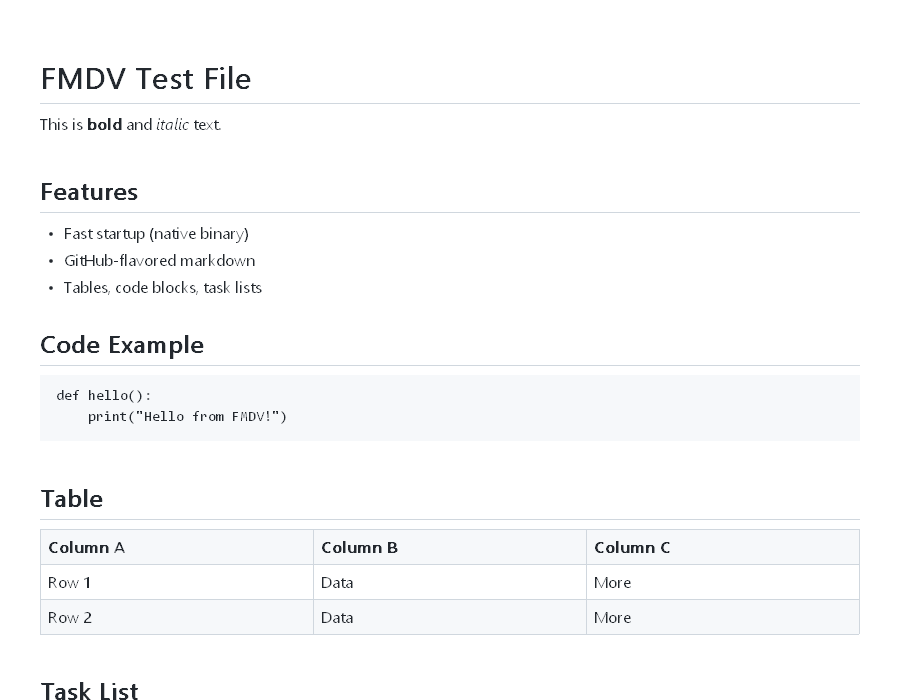
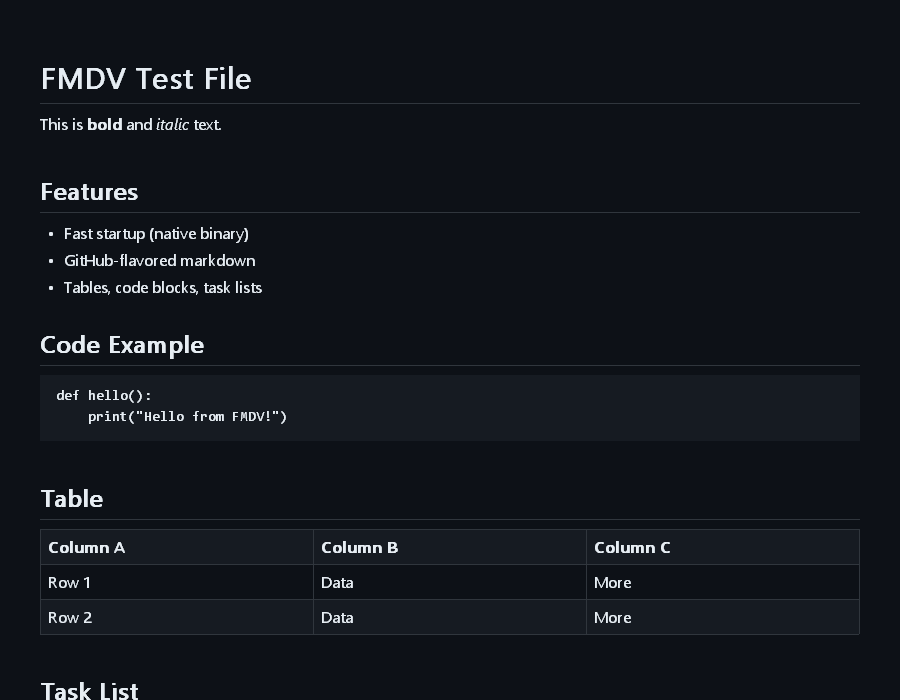
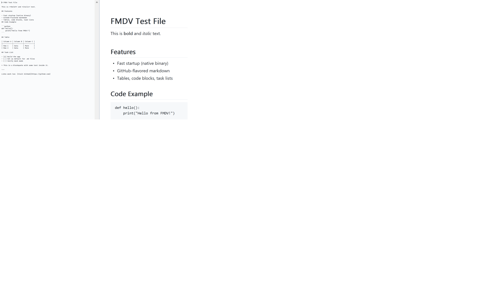

# FMDV — Fast MD Viewer

Native Windows markdown viewer/editor. Custom parser + Win32/GDI layout and
rendering. No browser engine.

- **~40–55 ms** cold first-paint (WebView2 equivalent: 250–500 ms)
- **~400 KB** single static exe, no runtime dependencies
- Layout is cached and painting is culled to the viewport: scroll repaints stay
  ~1.5 ms regardless of document size



<details>
<summary>Dark mode · split editor</summary>





</details>

## Run
Download `fmdv.exe` from the [latest release](../../releases/latest), or build
from source (below):

```
fmdv.exe path\to\file.md
```

Default `.md` handler: right-click a `.md` file → *Open with* → *Choose another
app* → browse to `fmdv.exe` → *Always*. Put the exe somewhere stable first
(e.g. `%LOCALAPPDATA%\Programs\FMDV\`) so the association survives.

## Features
- GitHub-style rendering: headings, bold/italic/strikethrough, inline + fenced
  code, blockquotes, bullet/ordered/nested/task lists, tables with alignment,
  rules, links, images (alt text). Light + dark themes.
- **Ctrl+E** split editor with live preview · **Ctrl+D** dark mode · **Ctrl+S**
  save (`Ctrl+Shift+S` save & close) · **Ctrl+±/0** and Ctrl+scroll zoom.
- Text selection + copy in the preview (double-click word, triple-click line, Ctrl+A).
- Clickable links, live reload on external file change, per-monitor DPI.
- Editor: markdown autocomplete (ghost text, Tab commits), list continuation on
  Enter, **Ctrl+T** table insert.
- **Ctrl+U** in-app updates from GitHub Releases: notify (default), auto-update,
  or pin any version — including downgrades.
- **Ctrl+Shift+O** table of contents sidebar — click a heading to jump to it.
- **Ctrl+F** find in doc: highlights all matches, Enter/Shift+Enter step
  through them (wraps around), Esc or the bar's close (X) button dismisses.
- Task checkboxes toggle in place on click (editor stays in sync).
- Code-block copy button — one click copies the code verbatim; selection copy
  also carries HTML formatting (headings, bold/italic, code, links) so pastes
  keep their structure — the markup comes from the shared `core/html_copy`.

## macOS port
A native macOS frontend is built on the shared, platform-neutral `core/`
(parser, edit helpers, layout, find/selection, clipboard HTML) with an
AppKit + CoreText/CoreGraphics UI — no browser engine, same priorities as the
Windows app. It opens files and renders (light/dark), scrolls, zooms,
selects/copies (incl. the rich HTML clipboard), follows links, finds
(**⌘F**, with the close X button), shows a TOC sidebar (**⌘⇧O**), and has a
split editor (**⌘E**) with ghost-text autocomplete, list continuation,
checkbox toggling, and table insert (**⌘T**). It reloads on external file
changes, persists dark/zoom/split across launches, and carries the full
**⌘U** updater parity set (notify / auto-update / pin / in-app install with
bundle swap). CI builds the CLI and the `.app`, runs the gating
`tests/run-tests.sh` UI suite (88 checks), and renders fixtures on
`macos-latest`. Feature parity is complete
([docs/macos-implementation-guide.md](docs/macos-implementation-guide.md#remaining-work),
2026-07-11); the only open item is a small hands-on QA residue, and
Developer ID signing + notarization run as the manual local release step.

## Source & build
The app is in [`cpp/`](cpp/) — see [cpp/README.md](cpp/README.md) for build
details, headless test/inspection flags, and source layout.
[cpp/ISSUES.md](cpp/ISSUES.md) is the development log.

```powershell
cd cpp
.\build.ps1                            # -> cpp\fmdv.exe
powershell -File tests\run-tests.ps1          # 116-check suite
powershell -File tests\run-tests-hidden.ps1   # same, windows kept off-screen
```

The shared `core/` has its own unit-test suites in [`tests/`](tests/) (parser,
layout, edit helpers, release parsing, string conversion, find/selection,
bench logging, clipboard HTML fragment builder — ~380 checks, ≈98% line
coverage of `core/`). Run them with
`make test` (macOS/Linux) or `ctest` after a CMake build; CI runs them on both
Windows (MinGW) and macOS.

Requires MinGW-w64 (GCC, UCRT — [winlibs](https://winlibs.com/) or MSYS2
`ucrt64`): have `g++` on `PATH`, set `FMDV_MINGW` to the toolchain's `bin`
directory, or pass `-MinGW <path>` to `build.ps1`.

## History
Originally a Go + WebView2 prototype
([`6fdb3e4`](../../commit/6fdb3e46eb6233c7e1192207154f7ea6a09b25a8));
rewritten in C++/Win32/GDI to eliminate browser-engine startup cost.

## License
[MIT](LICENSE)
